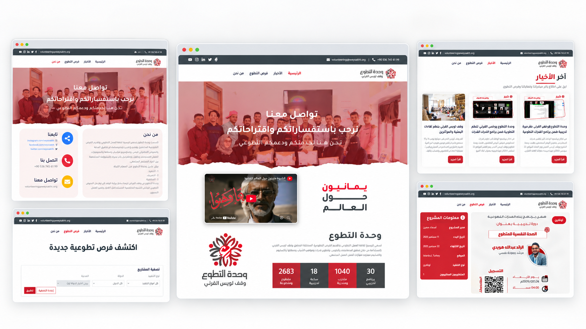

# Volunteer Unit Web Platform

**"Where volunteering meets meaningful impact"**

The **Volunteer Unit Web Platform** is a bilingual-ready Arabic web experience for discovering and managing volunteer opportunities. Built for the Owais Al-Qarni Foundation, it connects visitors with projects, news, featured Yemeni people, and useful information about the Volunteer Unit through a responsive public website and a dedicated administration dashboard.



[](https://react.dev/)
[](https://www.typescriptlang.org/)
[](https://vite.dev/)
[](https://expressjs.com/)
[](https://sequelize.org/)

## Table of Contents

1. [Key Features](#key-features)
2. [Tech Stack](#tech-stack)
3. [Project Structure](#project-structure)
4. [Installation & Setup](#installation--setup)
5. [Application Routes](#application-routes)
6. [Contributing](#contributing)
7. [Security](#security)

---

## Key Features

* **Volunteer opportunity discovery:** Browse project cards with dates, location, execution type, availability, requirements, and contact details.
* **Powerful project filters:** Filter opportunities by country, city, and execution type, with clear loading, empty, and error states.
* **Responsive Arabic experience:** A right-to-left interface designed for desktop and mobile screens with responsive navigation and shared layout components.
* **Project detail pages:** Open a complete opportunity profile and follow its external registration or project link.
* **News and community stories:** Read Volunteer Unit news in an accessible article dialog with progressive loading.
* **Featured Yemeni people:** Present inspiring Yemeni figures through an API-powered carousel on the home page.
* **Content management dashboard:** Administrators can manage projects, news, featured people, and execution types from a separate interface.
* **Image-backed content:** Upload and serve project, news, and featured-person images through the backend API.

## Tech Stack

### Public Web Application

* React 19 and TypeScript
* Vite 8 for development and production builds
* React Router for client-side navigation
* Bootstrap-derived responsive styles and Font Awesome icons
* ESLint for code quality

### Backend and Administration

* Node.js and Express REST API
* Sequelize ORM with MySQL
* JWT authentication and bcrypt password hashing
* Multer for image uploads
* Static HTML, Bootstrap 4, jQuery, DataTables, and SB Admin 2 for the admin dashboard

## Project Structure

```text
├── backend/                  # Express API, models, routes, uploads, and database setup
├── user_interface_react_app/ # React and TypeScript public website
├── admin_dashboard/           # Static administration dashboard
├── docs/                      # Product screenshots and capture guidance
├── SECURITY_AUDIT.md          # Security findings and release requirements
└── README.md
```

## Installation & Setup

### 1. Prepare the backend

Requirements: Node.js 20+, npm, MySQL, and a disposable development database.

```powershell
cd backend
npm ci
Copy-Item .env.example .env
```

Set the local database values in `.env`:

```env
DB_NAME=volunteer_unit
DB_USER=your_local_user
DB_PASS=your_local_password
DB_HOST=127.0.0.1
NODE_ENV=development
PORT=3000
URL=http://localhost:3000
UPLOADS=/uploads/
```

Start the API:

```powershell
npm start
```

The API runs at `http://localhost:3000`. Startup synchronizes the Sequelize schema, so use an isolated local database and do not point it at production data.

### 2. Run the public React website

Open a second terminal:

```powershell
cd user_interface_react_app
npm ci
Copy-Item .env.example .env
npm run dev
```

The Vite server prints the local URL, usually `http://localhost:5173`. The frontend uses `http://localhost:3000` by default. To change it, set this value in `user_interface_react_app/.env`:

```env
VITE_API_URL=http://localhost:3000
```

### 3. Run the administration dashboard

From the workspace root, open another terminal:

```powershell
python -m http.server 5501 --bind 127.0.0.1 --directory admin_dashboard
```

Open `http://localhost:5501/index.html` for the administrator login. An existing local admin account is required; the project does not provide shared demo credentials.

### 4. Validate the public application

```powershell
cd user_interface_react_app
npm run lint
npm run build
```

For a production preview after building:

```powershell
npm run preview
```

## Application Routes

| Route | Description |
| --- | --- |
| `/` | Home page, introduction, statistics, video, and featured people |
| `/projects` | Volunteer opportunities and project filters |
| `/projects/:projectId` | Full project details and registration link |
| `/news` | News listing and article reading dialog |
| `/contact` | Volunteer Unit information and contact details |

The API provides public read endpoints for projects, execution types, countries, cities, news, and featured people. Protected create, edit, and delete operations are managed through the administration dashboard.

## Contributing

Contributions are welcome. Keep changes focused, preserve Arabic RTL behavior, and document changes to API fields, routes, environment variables, or deployment requirements. Before opening a pull request, run:

```powershell
cd user_interface_react_app
npm run lint
npm run build
```

Use synthetic records and approved imagery in screenshots. The required desktop and mobile capture list is available in [docs/SCREENSHOTS.md](docs/SCREENSHOTS.md).

## Security

This project is still under review. Read [SECURITY_AUDIT.md](SECURITY_AUDIT.md) before publishing or deploying it. In particular:

* Never commit `.env` files, tokens, real personal records, or production credentials.
* Use a disposable database for local development because schema synchronization can alter tables.
* Configure the deployed API with HTTPS and restricted CORS origins.
* Replace the current development authentication and administrator-bootstrap assumptions before production use.
* Do not place secrets in `VITE_*` variables; Vite exposes them to the browser.

No project-wide license has been declared. Preserve the notices for Bootstrap, Font Awesome, SB Admin 2, and other bundled libraries, and confirm permission for project branding and imagery before redistribution.